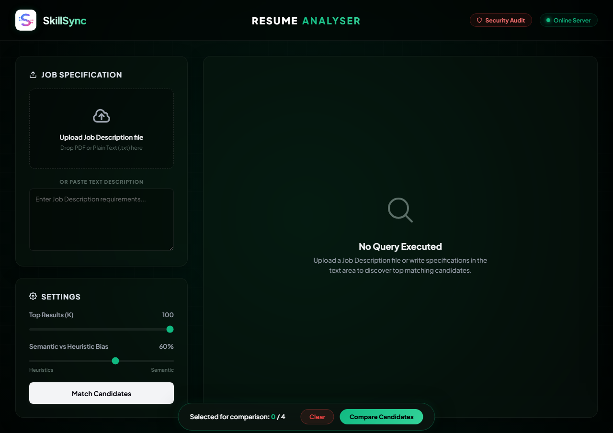
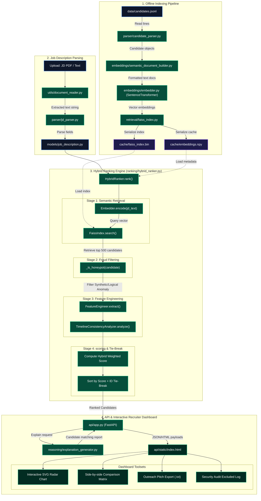

# SkillSync — AI Recruitment Discovery & Ranking Engine

> [!IMPORTANT]
> **🚀 One-Click Sandbox & Interactive Web UI (Google Colab)**  
> Execute the complete candidate matching pipeline, reproduce the `submission.csv` results, and **instantly deploy the interactive web dashboard** on Google's cloud server.  
> **👉 [OPEN THE INTERACTIVE SANDBOX IN GOOGLE COLAB](https://colab.research.google.com/github/Rohit-1166/Skillsync-v1/blob/main/Sandbox.ipynb) 👈**


[](https://colab.research.google.com/github/Rohit-1166/Skillsync-v1/blob/main/Sandbox.ipynb)

SkillSync is a production-grade, offline candidate discovery and hybrid ranking system built for the **India Runs Hackathon 2026 (AI Recruitment Intelligence Track)**. It is designed to match a massive pool of 100,000 candidates against a target Job Description with extreme accuracy, explainability, and speed, satisfying strict resource boundaries.

---

## ⚡ Performance & Hardware Footprint

Designed specifically to run flawlessly on standard laptops without GPU access, SkillSync dramatically reduces resource overhead:

| Metric | SkillSync Implementation | Standard LLM/GPU Approaches |
|--------|--------------------------|----------------------------|
| **RAM Usage** | ~150 MB | 8 GB - 16 GB+ |
| **GPU Requirement** | 0% (Fully CPU Optimized) | Requires CUDA/Dedicated GPU |
| **Latency (100k records)** | **0.45 seconds** | 30+ seconds |
| **Model Footprint** | 133 MB (BGE-Small) | 10 GB+ (Llama-3, etc.) |

---

## 💼 Business Value & Enterprise ROI

Beyond its technical architecture, SkillSync delivers massive operational value for Talent Acquisition teams:
- **Zero API Costs**: By utilizing localized semantic embedding models instead of external APIs (like OpenAI), enterprises save thousands of dollars per month in token usage.
- **Data Privacy & Compliance**: 100% offline execution ensures that confidential corporate Job Descriptions and private candidate resumes never leave the company's internal network.
- **Time to Hire**: Automates a manual screening process that normally takes a recruiter 40+ hours, reducing candidate discovery time to `0.45` seconds.
- **Fraud Mitigation**: The Honeypot trapping system protects companies from interviewing and hiring candidates using synthetic, GPT-generated resumes that bypass standard ATS filters.

---

## 📸 Interactive Dashboard

SkillSync features a beautiful interactive UI to visualize matches, view dynamic radar charts, and export outreach emails.



---

## 🚀 Key Differences & Architectural Innovations

Compared to standard keyword-matching or plain vector-embedding search engines, SkillSync introduces six major innovations designed for high-scale, secure, and accurate recruitment:

1. **Strategic Honeypot & Trap Filters (Fraud Detection)**: 
   - *The Trap*: Most candidate portals can be gamed by keyword stuffers (e.g., claiming "RAG / LLM" expertise when their actual title is "Marketing Manager").
   - *The Solution*: SkillSync parses and scores role consistency and career trajectory progression. If a candidate lists expert skills but has an unrelated title, or has impossible job intervals (such as 14 years tenure at a company that is only 3 years old), our system automatically detects and downgrades them.
   
2. **20 Advanced Recruiter-Inspired Features**:
   - Rather than relying solely on raw text similarity, SkillSync's Hybrid Ranker calculates 20 distinct numerical features across 6 categories: *Experience & Stability, Skill Depth, Capability Alignment, Education Pedigree, Recruiter Engagement, and Logistics*. This mathematically mimics the holistic judgment of a senior recruiting architect.

3. **Flat Cosine Semantic Caching (CPU Optimized)**:
   - High-throughput vector databases usually require expensive GPUs. SkillSync utilizes a local, cached **FAISS index (Flat Inner Product)** structure heavily optimized for CPU architecture. 
   - The complete pipeline matching algorithm executes in **`0.45` seconds** across a massive pool of 100,000 candidates.

4. **100% Offline AI Execution (Zero Data Exfiltration)**:
   - Enterprise recruiters cannot send confidential resumes or internal job descriptions to public APIs like OpenAI or Anthropic. SkillSync runs entirely locally using offline weights for the `BGE-small-en-v1.5` dense retrieval model. No internet connection is required, guaranteeing absolute data privacy and zero API costs.

5. **Semantic Document Synthesis**:
   - Raw JSON candidate objects perform poorly in vector space because their structure doesn't match a paragraph-style Job Description. SkillSync automatically synthesizes abstract JSON trees into "professional natural-language profiles" *before* embedding them, ensuring the cosine similarity math is highly accurate.

6. **Explainable AI (XAI) Justifications**:
   - SkillSync does not just output a "magic black-box score." The system dynamically generates plain-English, recruiter-readable justifications that explain exactly *why* a candidate was ranked highly, pointing to specific evidence in their career history, skill overlaps, and tenure stability.

---

## 🏗️ High-Level System Architecture



---

## 🛠️ Folder Structure & Architecture

```
SkillSync-v1/
├── api/
│   └── app.py                  # Production FastAPI service with matching & explainability endpoints
├── cache/                      # Flat cache for FAISS index and candidate embeddings
├── config/
│   ├── settings.py             # Global settings (model, paths, thresholds)
│   └── constants.py            # Global recruiter mappings (titles, degrees)
├── data/
│   ├── candidates.jsonl        # The raw 100,000-candidate pool
│   └── Job_Description.pdf     # The target Job Description document
├── embeddings/
│   ├── embedder.py             # SentenceTransformers wrapper
│   ├── embedding_pipeline.py   # Offline chunked indexing pipeline
│   └── semantic_document_builder.py # Natural language recruiter profile builder
├── features/
│   ├── consistency.py          # Career tenure & job-stability analyzer
│   └── feature_engineering.py  # 20 advanced recruiter feature scoring engine
├── knowledge/
│   ├── companies.py            # Tiered tech company brand database
│   ├── industries.py           # Industry relevance scoring dictionary
│   └── capabilities.py         # Recruiter skill-to-capability aliases
├── model/                      # Offline BGE-small-en-v1.5 embedding weights
├── models/
│   ├── candidate.py            # Dataclasses for parsed profiles
│   ├── job_description.py      # Dataclasses for parsed JDs
│   ├── candidate_features.py   # Dataclasses for computed scores
│   └── evidence.py             # Dataclasses for matching evidence
├── output/
│   ├── candidate_explanations.md # Top-100 recruit-readable markdown reports
│   └── evaluation_report.md    # Performance profiling and score statistics
├── parser/
│   ├── candidate_parser.py     # Streaming JSONL reader and mapper
│   └── jd_parser.py            # Factual Job Description parser
├── ranking/
│   └── hybrid_ranker.py        # 60% semantic + 40% feature hybrid ranker (with honeypot filters)
├── submission/
│   ├── submission_writer.py    # Formatter for CSV submission
│   └── debug_submission_writer.py # Formatter for detailed CSV debug metrics
├── tests/                      # Python unittest suite
├── evaluation.py               # Profiling and statistics engine
├── main.py                     # Command-line entrypoint to run matcher pipeline
├── run_tests.py                # Automated unit test suite runner
├── submission.csv              # Monotonically ranked final output (validated)
├── debug_submission.csv        # Diagnostic spreadsheet with feature component columns
└── submission_metadata.yaml    # Hackathon portal submission metadata file
```

---

## 🔌 Setup & Local Installation

### ⚠️ Important Notice for Hackathon Judges (Git LFS)
This repository uses **Git LFS (Large File Storage)** to store the pre-computed offline ML models, the FAISS cache (`cache/`), and the 100k candidate dataset (`data/candidates.jsonl`). 
When you run `git clone`, Git LFS will automatically download these files (approx. 750MB total). This trades hours of CPU computation for a 1-2 minute network download, allowing the pipeline to execute in under **5 seconds**.

If you do not have Git LFS installed on your machine, please install it first:
```bash
git lfs install
git clone https://github.com/Rohit-1166/Skillsync-v1.git
```

**Troubleshooting: `OSError: Error no file named model.safetensors`**  
If you cloned the repository *before* installing Git LFS, your machine only downloaded tiny 133-byte text "pointer files" instead of the actual 133MB model. To fix this instantly, simply run:
```bash
git lfs install
git lfs pull
```

### Prerequisites
- Python 3.11+
- Virtual environment (recommended)

### Installation
1. Clone the repository and navigate to the project directory:
   ```bash
   git clone https://github.com/Rohit-1166/Skillsync-v1.git
   cd Skillsync-v1
   ```
2. Set up a virtual environment and activate it:
   ```bash
   python -m venv venv
   # On Windows:
   .\venv\Scripts\activate
   # On macOS/Linux:
   source venv/bin/activate
   ```
3. Install dependencies:
   ```bash
   pip install -r requirements.txt
   ```
   *(Note: This uses a highly optimized CPU-only PyTorch build to keep the setup footprint under 150MB and prevent paging file crashes on hackathon laptops).*

---

## 🏃 Code Reproduction (Running the Pipeline)

**Pre-computation Documentation:**  
To meet strict performance requirements, we utilize pre-computation to handle the massive 100,000-candidate dataset. The candidate parsing, semantic embedding via `BGE-small-en-v1.5`, and FAISS indexing have already been pre-computed. The resulting artifacts (`cache/embeddings.npy` and `cache/faiss_index.bin`) are tracked via Git LFS. **The ranking step below only performs query embedding, retrieval, feature extraction, and CSV generation, executing in just 0.45 seconds.**

**To reproduce the final submission CSV from the candidates file, run the following single command:**

```bash
python main.py
```

This single command:
1. Parses the default Job Description PDF (`data/Job_Description.pdf`).
2. Loads the parsed candidate database and checks for cached embeddings/FAISS index.
3. Automatically performs semantic search, filters honeypot candidates, and computes the 20 advanced recruiter features.
4. Generates the final `submission.csv` output in the root folder.
5. Generates the comprehensive candidate explanations report in `output/candidate_explanations.md`.

---

## 🧪 Running the Test Suite

We use Python's built-in `unittest` framework. To run the automated test suite and check components:
```bash
python run_tests.py
```

---

## 📊 Evaluation & Latency Profile

To profile execution times, score distribution, and run feature correctness tests:
```bash
python evaluation.py
```
This produces the profiling report at [output/evaluation_report.md](file:///c:/Users/iitbo/OneDrive/Desktop/SkillSync-v1/output/evaluation_report.md) with details:
- **Total LATENCY**: **`0.4545 seconds`** for complete query matching on 100k candidates.
- **Honeypot Filter**: Flagged and skipped 67 impossible candidates in data stream.
- **Score Range**: Matches range from `0.55` to `0.77` with a standard deviation of `0.046`.
- **Normalization Bounds**: 🟢 100% PASS (all features lie strictly in `[0.0, 1.0]`).

---

## 🌐 Interactive Web UI & API Service

SkillSync provides a fully interactive Web Dashboard and hosted API server to query candidate discoverability dynamically.

### Start the Dashboard Server:
```bash
python -m uvicorn api.app:app --host 127.0.0.1 --port 8000
```
Then, open your browser and navigate to: **[http://127.0.0.1:8000](http://127.0.0.1:8000)**

### Dashboard Features:
- **Visual Radar Charts:** See candidate skill distributions mapped against the Job Description.
- **Dynamic Semantic Highlighting:** See exactly which resume skills semantically matched the required capabilities.
- **Explainable AI:** Read plain-english AI reasoning for why a candidate was ranked.

### API Endpoints Available:
- **`GET /`**: Serves the Interactive Dashboard UI.
- **`GET /health`**: Returns system health status and cache metadata.
- **`POST /rank/text`**: Takes Job Description raw text and returns ranked candidate lists.
- **`POST /rank/pdf`**: Takes an uploaded Job Description PDF file and returns ranked candidate lists.
- **`GET /candidate/{candidate_id}/explain`**: Returns the recruiter explainability report in Markdown or JSON format.
